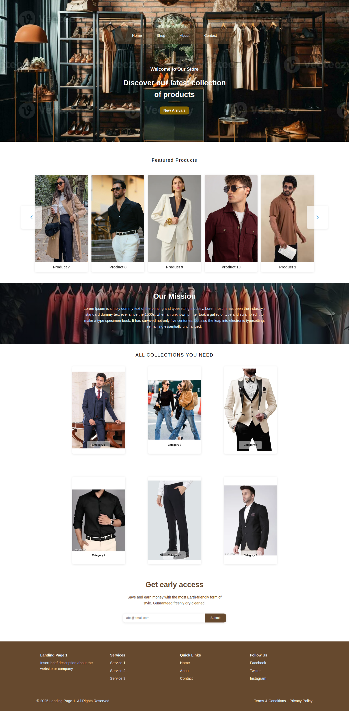
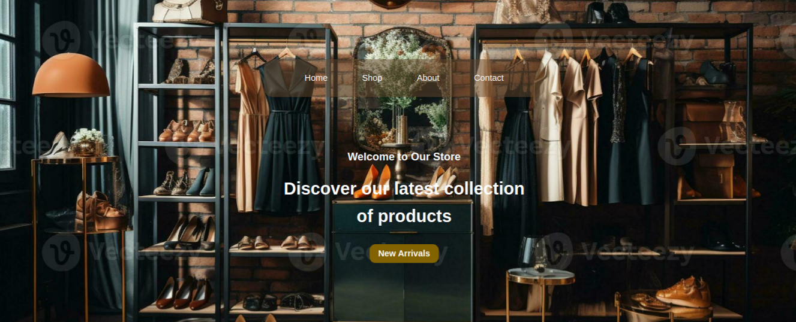
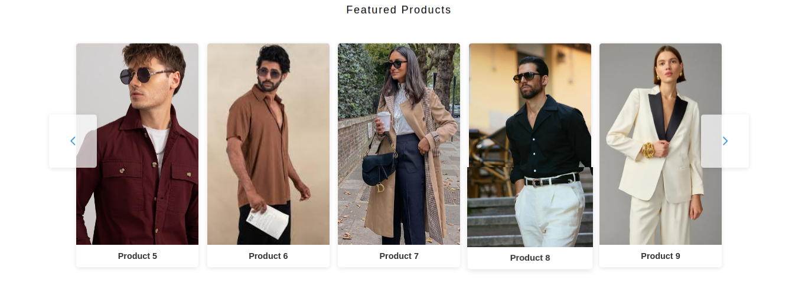
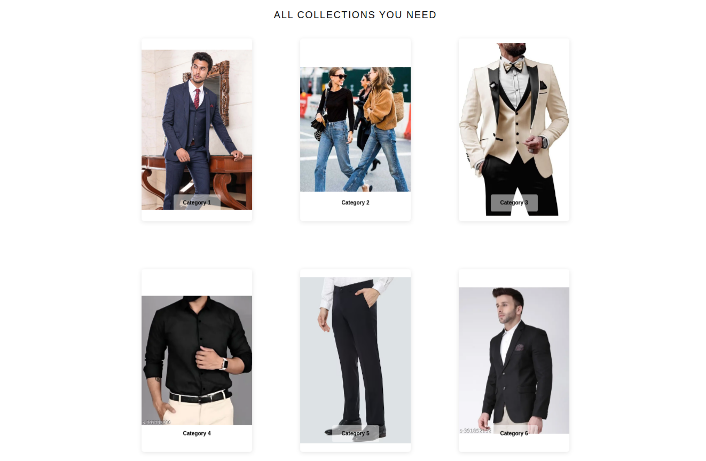
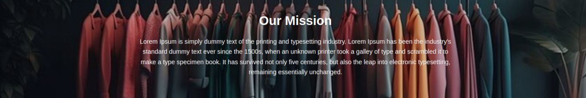
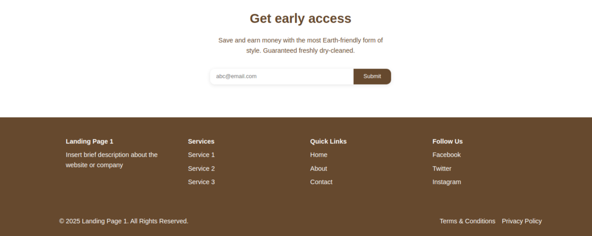

# Clothes Landing Page

A modern, responsive landing page built with Angular for a clothing brand. This standalone application showcases various clothing categories, featured products, and brand information.

## Project Overview

This landing page is built using Angular's standalone components architecture, featuring a clean and modern design perfect for clothing and fashion brands. The page includes various sections from navigation to contact forms, all styled with CSS variables for easy customization.

## Features

- Fully responsive design (Mobile, Tablet, Desktop)
- Modular component architecture
- Clean and modern UI
- Easy to customize
- Optimized performance
- Interactive elements

## Screenshots

### Full Landing Page

*Complete view of the landing page showcasing all sections*

### Hero Section

*Hero section with striking background and call-to-action*

### Featured Products

*Carousel of featured clothing products with product cards*

### Categories Section

*Grid layout of different clothing categories*

### Our Mission

*Brand mission statement and values*

### Contact & Footer

*Contact form and footer with important links*

## Components Structure

```
src/
├── app/
│   ├── components/
│   │   ├── navbar/
│   │   ├── hero-section/
│   │   ├── featured-product/
│   │   ├── shop/
│   │   ├── about-us/
│   │   ├── contact/
│   │   └── footer/
│   └── ...
└── assets/
    ├── images/
    ├── icons/
    └── screenshots/
```

## Technology Stack

- Angular (Latest Version)
- Standalone Components
- CSS Variables
- Responsive Design
- Modern JavaScript/TypeScript

## Color Scheme

- Primary Color: #3498db (Blue)
- Secondary Color: #2ecc71 (Green)
- Background Color: #f4f4f4 (Light Gray)
- Text Color: #333 (Dark Gray)

## Getting Started

1. Clone the repository
```bash
git clone [repository-url]
```

2. Install dependencies
```bash
npm install
```

3. Run development server
```bash
ng serve
```

4. Open browser and navigate to
```
http://localhost:4200
```

## Customization

### Images
- Replace images in `src/assets/images/`
- Categories images: `category1.png` to `category6.png`
- Product images: `product1.png` to `product5.png`
- Background images: `hero-bg.png`, `about-bg.png`

### Styles
- Global styles in `src/styles.css`
- Component-specific styles in respective component folders

### Content
- Modify text content in component HTML files
- Update links in navbar and footer components

## Build for Production

```bash
ng build --configuration=production
```

## Performance Optimization

- Lazy loaded images
- Optimized assets
- Efficient component structure
- Minimal dependencies

## Browser Support

- Chrome (latest)
- Firefox (latest)
- Safari (latest)
- Edge (latest)

## Contributing

1. Fork the repository
2. Create your feature branch
3. Commit your changes
4. Push to the branch
5. Create a new Pull Request

## License

[MIT License](LICENSE)

## Contact

For any queries or support, please open an issue in the repository. 